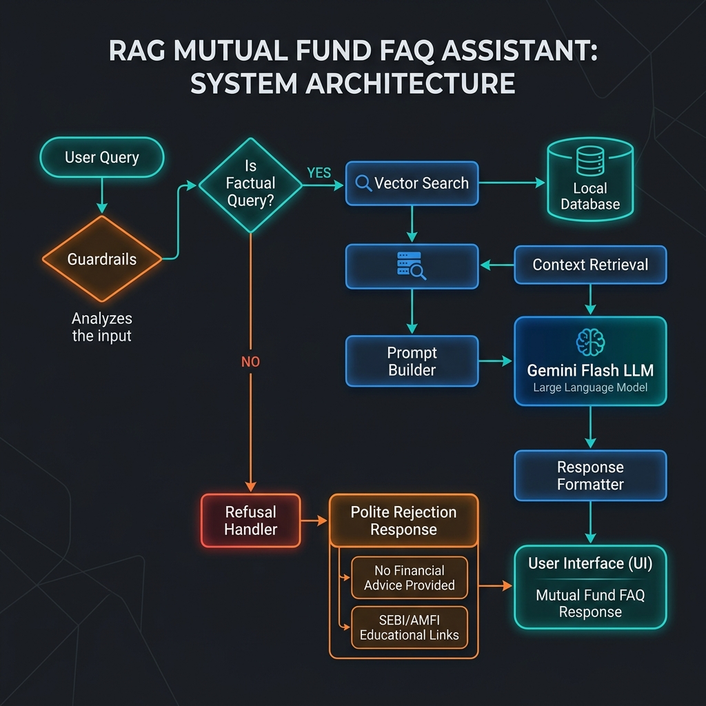

# System Architecture: Mutual Fund FAQ Assistant (Facts-Only Q&A)

## System Overview
The Mutual Fund FAQ Assistant is a Retrieval-Augmented Generation (RAG) system designed to answer factual, verifiable queries regarding HDFC Mutual Fund schemes. The system operates on a "facts-only" constraint, retrieving information exclusively from a curated corpus of 15 official public URLs. It strictly rejects advisory or recommendation queries.

---

## Architecture Diagram

---

## Key Components

### 1. Ingestion Pipeline
*   **Ingestion Scheduler**: A cron-based automation scheduler that runs **daily at 10:00 AM IST** (04:30 AM UTC). It triggers the ingestion component to fetch fresh mutual fund data from the target sources, keeping the vector store constantly updated with the latest scheme details.
*   **Web Scraper**: Extracts raw content from the 15 designated Groww HDFC scheme URLs.
*   **Text Cleaner**: Scrubs HTML boilerplate, navigation elements, footers, and advertising sections to extract clean, structural textual information (scheme details, expense ratios, exit loads, benchmark index, fund managers, lock-in periods).
*   **Chunker**: Splits the parsed documents into semantic paragraphs or fixed-size chunks (e.g., 500 characters with 100 character overlap) to ensure precision in search results.

### 2. Retrieval Engine & Vector Store
*   **Embedding Model**: Converts chunks and user queries into vector embeddings (e.g., Google Gemini Embeddings or HuggingFace models).
*   **Vector Store**: A lightweight local vector store (e.g., ChromaDB, FAISS, or an in-memory cosine-similarity store) that indices the chunks.
*   **Retriever**: Performs similarity search (cosine distance) to fetch the top $K$ (e.g., $K=3$) most relevant chunks for a user query.

### 3. Guardrails & Refusal Classifier
*   **Intent Classifier**: Analyzes incoming queries to determine if they are **factual** (e.g., "What is the exit load of HDFC Small Cap Fund?") or **advisory/opinion-based** (e.g., "Should I buy HDFC Mid-Cap fund?", "Which is better?").
*   **Refusal Handler**: If the intent is classified as advisory or non-factual:
    *   Bypasses LLM generation.
    *   Returns a polite, pre-defined refusal response reinforcing the facts-only boundary.
    *   Includes a standard educational link to SEBI or AMFI resources.

### 4. Generation & Compliance Engine
*   **Prompt Engineering**: Combines retrieved context, the user query, and a strict system prompt instructing the LLM to behave strictly as a factual assistant.
*   **LLM (Gemini Flash)**: Processes the prompt. Gemini's high context window and speed are optimized for fast RAG operations.
*   **Compliance Guard**: Enforces formatting:
    1.  Maximum of **3 sentences**.
    2.  Exactly **one citation link** referencing the source URL.
    3.  A footer with the date of retrieval: `Last updated from sources: <date>`.

### 5. Frontend & Chat Interface
*   A premium, responsive web interface built using HTML, CSS, and Javascript.
*   Includes a visible disclaimer banner: `Facts-only. No investment advice.`
*   Features 3 clickable example questions to guide user expectations.

---

## Detailed Data Flows

### A. Factual Query Flow
1. User submits: *"Who manages the HDFC Defence Fund?"*
2. Classifier detects **Factual** intent.
3. Query is vectorized and similarity search is performed against the vector store.
4. Top 3 chunks detailing the HDFC Defence Fund management team are retrieved.
5. Prompt is assembled with the context chunks and instructions.
6. LLM generates a response: *"HDFC Defence Fund is managed by Mr. Dhruv Muchhal (since inception). He has over X years of experience in equity markets. [Source Link]. Last updated from sources: <date>"*
7. Chat interface renders the response.

### B. Advisory/Opinion Query Flow
1. User submits: *"Which HDFC fund is best for high returns?"*
2. Classifier detects **Advisory** intent.
3. System blocks retrieval and generation.
4. System returns: *"I am a facts-only assistant and cannot provide investment advice, recommendations, or performance comparisons. Please consult a registered financial advisor or refer to the official AMC factsheets. For educational resources, visit [AMFI](https://www.amfiindia.com/)."*

---

## Privacy & Security Controls
*   **PII Sanitizer**: Regex-based scanners on the input query to detect and block PII (such as PAN, Aadhaar, account numbers, email addresses, or phone numbers) before processing.
*   **Zero Logs Storage**: Conversations are processed in-memory and not written to persistent logs, protecting user privacy.
