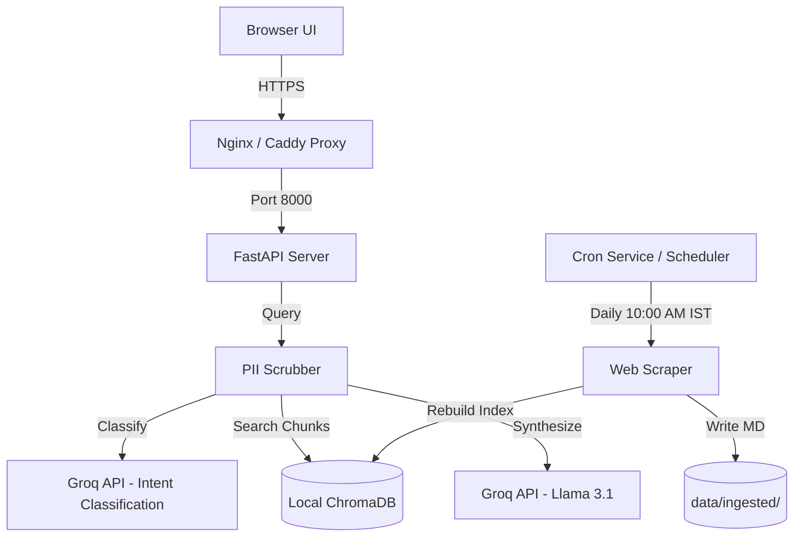

# Deployment Plan: Mutual Fund FAQ Assistant

This document outlines the strategy, configuration, and step-by-step instructions for deploying the facts-only Mutual Fund FAQ Assistant to a production environment.

---

## 1. Deployment Architecture

The application is lightweight and composed of:
1.  **FastAPI Backend & Static UI Server**: Handles requests, routes guardrails/PII scrubbing, queries ChromaDB, and generates LLM answers via Groq.
2.  **Daily Ingestion Scheduler**: Periodically scrapes official source pages to refresh local Markdown files and rebuild the ChromaDB index.
3.  **Local Chroma Database**: A file-based persistent vector database stored at `data/chroma`.



---

## 2. Environment Variables Configuration

Create a production `.env` file in the application root directory:

```env
GROQ_API_KEY=your_groq_api_key_here

# Server Bindings
HOST=0.0.0.0
PORT=8000
ENV=production
```

---

## 3. Option A: Containerized Deployment (Recommended)

Containerizing the application ensures consistent environment builds (especially regarding Python, ChromaDB C++ extensions, and cached embedding models).

### 3.1 Dockerfile
Create a [Dockerfile](file:///c:/Users/ankit/OneDrive/Documents/Rag%20FAQ%20Chatbot/Dockerfile) in the root directory:

```dockerfile
FROM python:3.11-slim

# Install C++ build essentials required by ChromaDB
RUN apt-get update && apt-get install -y --no-install-recommends \
    build-essential \
    curl \
    && rm -rf /var/lib/apt/lists/*

WORKDIR /app

COPY requirements.txt .
RUN pip install --no-cache-dir --upgrade pip && \
    pip install --no-cache-dir -r requirements.txt

# Pre-download the BGE-Small sentence-transformers model during build time 
# to prevent download delays or failures on container startup.
RUN python -c "from sentence_transformers import SentenceTransformer; SentenceTransformer('BAAI/bge-small-en-v1.5')"

COPY . .

# Run database build once during build to seed initial vector space
RUN python src/ingestion/scraper.py && python src/rag/indexer.py

EXPOSE 8000

CMD ["uvicorn", "src.api.main:app", "--host", "0.0.0.0", "--port", "8000"]
```

### 3.2 Docker Compose
Create a [docker-compose.yml](file:///c:/Users/ankit/OneDrive/Documents/Rag%20FAQ%20Chatbot/docker-compose.yml) file in the root directory:

```yaml
version: '3.8'

services:
  faq-assistant:
    build: .
    ports:
      - "8000:8000"
    environment:
      - GROQ_API_KEY=${GROQ_API_KEY}
    volumes:
      - faq-data:/app/data
    restart: always

volumes:
  faq-data:
```

---

## 4. Option B: Cloud PaaS Deployment (e.g., Render / Railway)

If deploying to a PaaS platform like **Render** or **Railway**:

1.  **Configure Web Service**:
    *   **Repository**: Link your GitHub repository (`BasicProject`).
    *   **Build Command**:
        ```bash
        pip install -r requirements.txt && python src/ingestion/scraper.py && python src/rag/indexer.py
        ```
    *   **Start Command**:
        ```bash
        uvicorn src.api.main:app --host 0.0.0.0 --port $PORT
        ```
    *   **Disk Mount (Important)**: Mount a persistent directory at `/app/data` (minimum 1GB) so that cached ChromaDB vectors and ingested files persist across service redeployments.
2.  **Add Environment Variables**: Set `GROQ_API_KEY` in the service settings panel.

---

## 5. Ingestion Scheduler Deployment

In a production environment, running a python `while True` loop indefinitely for scheduling (`scheduler.py`) is prone to memory leaks. Instead, manage scheduled runs using the OS cron daemon.

### 5.1 Host Cron Setup (VPS Deployment)
Set up a cron job on your deployment host to trigger the ingestion and index rebuild daily at `10:00 AM IST` (`04:30 AM UTC`):

1.  Open the crontab editor:
    ```bash
    crontab -e
    ```
2.  Add the following line (adjusting paths to your installation directory and venv virtual environment):
    ```cron
    30 4 * * * cd /home/ubuntu/Rag-FAQ-Chatbot && ./venv/bin/python src/ingestion/scraper.py && ./venv/bin/python src/rag/indexer.py >> logs/cron.log 2>&1
    ```

---

## 6. Reverse Proxy & SSL (Nginx Setup)

Secure your deployment with HTTPS by configuring Nginx as a reverse proxy with Let's Encrypt certificates.

### 6.1 Nginx Config
Create a server block `/etc/nginx/sites-available/faq-assistant`:

```nginx
server {
    listen 80;
    server_name yourdomain.com;

    location / {
        proxy_pass http://127.0.0.1:8000;
        proxy_set_header Host $host;
        proxy_set_header X-Real-IP $remote_addr;
        proxy_set_header X-Forwarded-For $proxy_add_x_forwarded_for;
        proxy_set_header X-Forwarded-Proto $scheme;
    }
}
```

Enable the configuration and reload Nginx:
```bash
sudo ln -s /etc/nginx/sites-available/faq-assistant /etc/nginx/sites-enabled/
sudo nginx -t
sudo systemctl reload nginx
```

### 6.2 Certbot SSL
Install Certbot and acquire an SSL certificate automatically:
```bash
sudo apt-get install certbot python3-certbot-nginx
sudo certbot --nginx -d yourdomain.com
```
